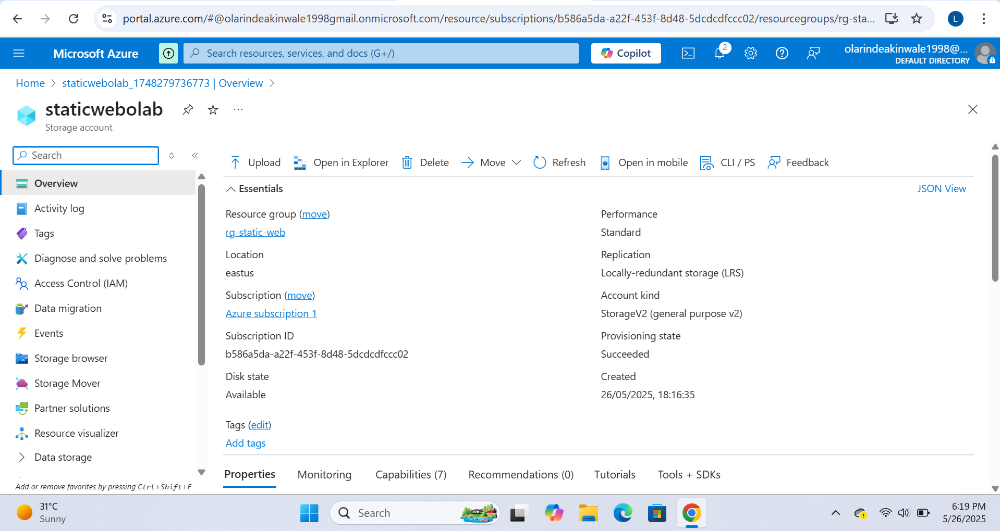
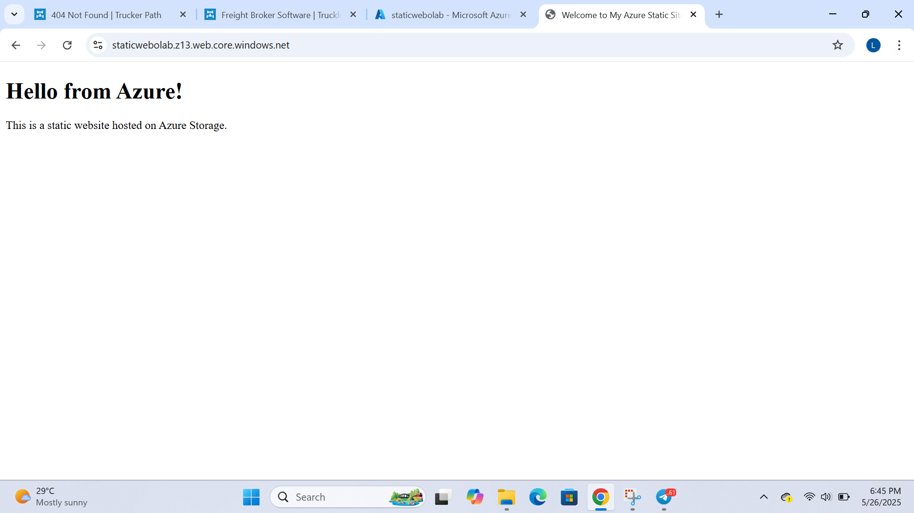
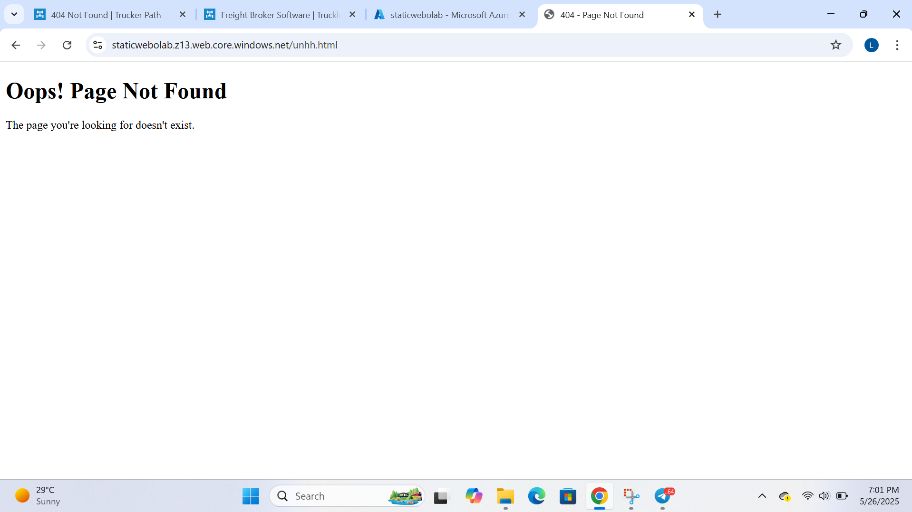

# AZ-900 Static Website Deployment (Project 2)

This project demonstrates how I deployed a static website using Azure Blob Storage and Static Website Hosting under the Microsoft Azure free tier. It builds on core concepts from the AZ-900 certification, helping me understand storage and web hosting within the cloud.

## Objective

To gain hands-on experience with:
- Creating a Storage Account in Azure
- Hosting a static website using Azure Blob service
- Configuring the static site with index and error pages
- Understanding blob containers, redundancy, and web endpoints

## Key Configurations

- Storage Account Name: staticweblolab  
- Resource Group: rg-static-web  
- Location: East US  
- Replication: Locally-redundant storage (LRS)  
- Account Kind: StorageV2  
- Static Site: Enabled  

## Screenshots

### 1. Storage Account Overview

### 2. Static Website Live View

### 3. Error Page Preview

## Tools Used

- Microsoft Azure Portal  
- GitHub for documentation  
- Visual Studio Code 

## What I Learned

- Blob storage and redundancy settings  
- Static web hosting with index/error routing  
- Basic cloud storage security and access control  
- Publishing a website using cloud infrastructure  

  

---

*By Olarinde Abdulafees — Azure Cloud Security Engineer*
